# Hey, I'm Clément 👋

5th-year engineering student passionate about functional programming and modern web development.

## Current Focus

- 🔧 Interning at EDF working on virtualization
- 💜 Building with **Gleam** - exploring functional programming paradigms
- 🌐 Developing full-stack applications with React, TypeScript & FastAPI

## Tech Stack

**Languages & Frameworks**
- Gleam, TypeScript, Python
- React, FastAPI
- Functional programming enthusiast

**Cloud & DevOps**
- Google Cloud Platform
- Docker, Virtualization
- Infrastructure as Code

## GitHub Activity

<picture>
  
</picture>
</img>

## Currently Learning

- Advanced Gleam patterns and ecosystem contribution
- Cloud architecture and deployment strategies
- Network theory applications in software

💡 *Always exploring, always building*
